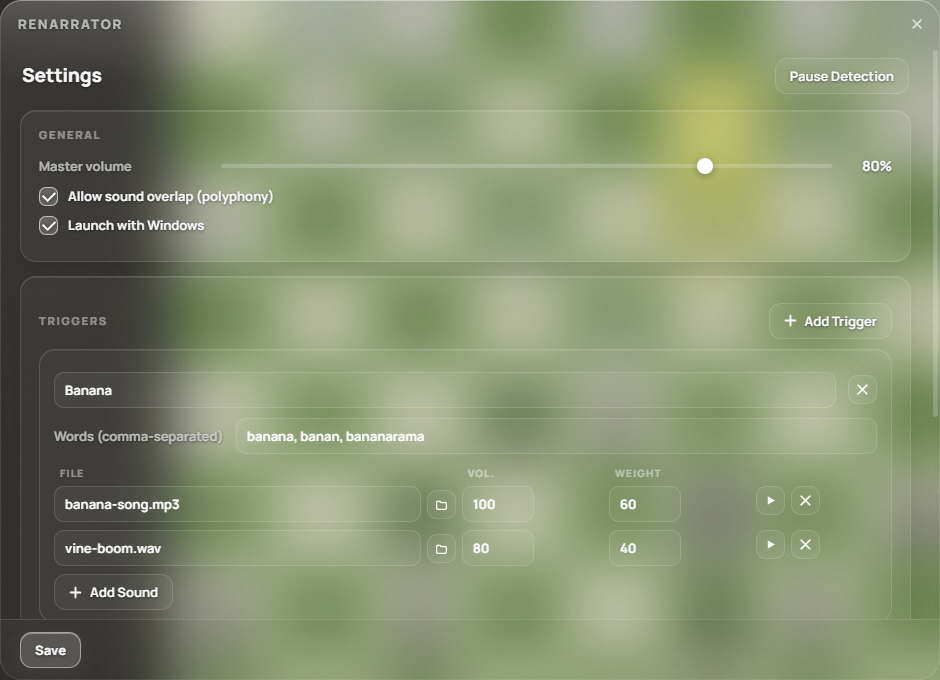

<div align="center">
  
  <h1>Renarrator</h1>
  <p>
    <b>Фоновый движок триггер-звуков по вводу с клавиатуры.</b><br/>
    Печатаешь слово — Windows играет звук. Живёт в трее, не зависит от раскладки.
  </p>
  <p>
    
    
    
    
  </p>
</div>



## Что это

Renarrator — фоновое приложение для Windows, которое отслеживает ввод с физической
клавиатуры в **любом** приложении и при совпадении набранного слова с одним из
твоих триггеров мгновенно воспроизводит звуковой эффект.

Набрал `банан` в чате, в игре, в блокноте — получил звук. Раскладка клавиатуры
(русская/английская) значения не имеет: движок сравнивает **физические клавиши**,
а не символы, поэтому `banan` и `ифтфт` — это одно и то же слово для триггера.

## Возможности

- **Глобальный перехват клавиатуры** — low-level hook (WinAPI `WH_KEYBOARD_LL` через `rdev`),
  работает поверх любых приложений без фокуса на окне.
- **Раскладка-независимые триггеры: слова, цифры и фразы** — mapping физических
  клавиш → символы, регистр не важен. Триггером может быть слово (`банан`),
  цифровой код (`123`) или фраза с пробелом (`банан яблоко` — срабатывает
  на последней букве, финальный пробел не нужен). `Enter`/`Backspace` и пауза
  > 2 с сбрасывают буфер; `Space` — разделитель слов внутри фразы.
- **Несколько звуков на триггер с весами** — взвешенный случайный выбор
  (`P = weight / Σweights`), чтобы мемы не приедались.
- **Полифония / overlap** — звуки накладываются друг на друга либо прерывают
  предыдущие (переключается одной галочкой).
- **Гибкая громкость** — master-громкость × громкость каждого файла.
- **Форматы аудио**: `.mp3`, `.wav`, `.ogg` (движок `rodio` / WASAPI).
- **Системный трей** — ЛКМ по иконке открывает настройки, ПКМ — быстрое меню
  (пауза детекции / стоп всех звуков / выход).
- **Drag & drop** — перетащи аудиофайл прямо в строку звука в настройках.
- **Автозагрузка Windows** — опционально, через `HKCU\...\Run`.
- **Стеклянный UI** — acrylic blur и скруглённые углы через DWM, кастомный титлбар.

## Установка (для пользователя)

1. Открой страницу [Releases](https://github.com/reteren/renarrator/releases).
2. Скачай `Renarrator_x.x.x_x64-setup.exe` из последнего релиза.
3. Запусти установщик (NSIS) — ярлык появится в меню «Пуск».
4. После запуска приложение сидит в трее. ЛКМ по иконке → настройки:
   добавь триггер, впиши слова, перетащи звуки, нажми **Save**.

> Windows SmartScreen может предупредить о неподписанном установщике
> (код не подписан сертификатом EV) — «Подробнее → Выполнить в любом случае».

### Где лежит конфиг

`%APPDATA%\KeySoundTrigger\config.json` — создаётся автоматически при первом
запуске, можно править руками (приложение подхватит при следующем сохранении).

### Приватность

Буфер нажатий живёт **только в оперативной памяти**, сбрасывается после каждого
слова и никуда не отправляется. Приложение вообще не обращается к сети.

## Сборка из исходников

**Требования:** Windows 10/11, [Rust stable (MSVC)](https://rustup.rs/),
[Node.js 18+](https://nodejs.org/), Visual Studio Build Tools (рабочая нагрузка
«C++ build tools»), WebView2 (в Windows 11 встроен).

```powershell
git clone https://github.com/reteren/renarrator.git
cd renarrator
npm install

# dev-режим (hot-reload UI)
npm run dev

# релизная сборка → src-tauri\target\release\bundle\nsis\
npm run build
```

## Выпуск релиза (для мейнтейнера)

```powershell
git tag v0.2.0
git push origin v0.2.0
```

GitHub Actions (`.github/workflows/release.yml`) соберёт NSIS-установщик и
опубликует релиз с артефактом `Renarrator_x64-setup.exe` — пользователям
достаточно скачать и запустить его.

## Структура проекта

```
├─ src/                     # фронтенд (vanilla JS, без сборщика)
│  ├─ index.html            # окно настроек
│  ├─ tray-menu.html        # кастомное меню трея
│  └─ fonts/                # Manrope (woff2)
├─ src-tauri/
│  ├─ src/
│  │  ├─ lib.rs             # точка сборки: окна, трей, Tauri commands, updater
│  │  ├─ keyboard_hook.rs   # глобальный low-level hook (rdev)
│  │  ├─ layout_map.rs      # физические клавиши → символы (RU/EN)
│  │  ├─ buffer_manager.rs  # буфер ввода, таймауты, матчинг слов
│  │  ├─ audio_engine.rs    # rodio: полифония, веса, громкость
│  │  ├─ config.rs          # %APPDATA%\KeySoundTrigger\config.json
│  │  ├─ autostart.rs       # автозагрузка через реестр
│  │  └─ win_glass.rs       # DWM acrylic + скруглённые регионы
│  └─ tauri.conf.json
└─ .github/workflows/       # CI релизов
```

## Лицензия

[MIT](LICENSE) © reteren
